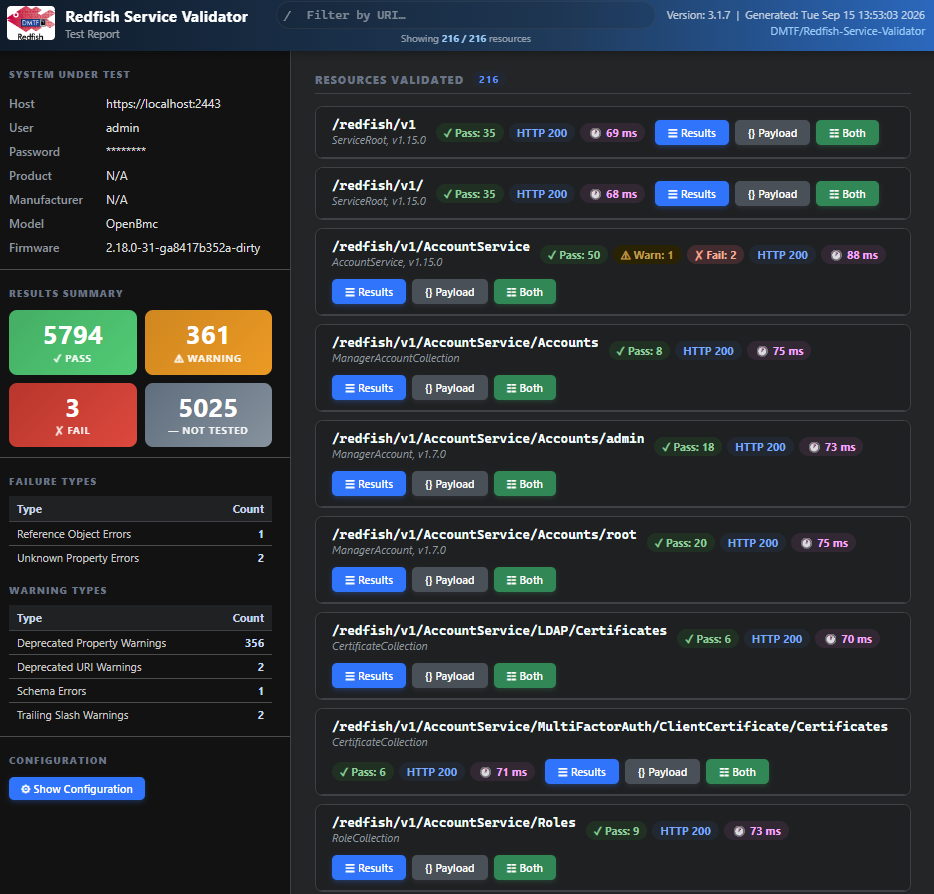
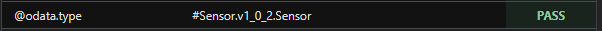
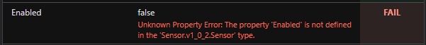
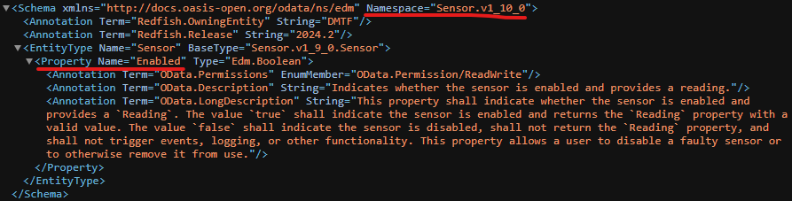

This tool validate the conformance a Redfish service implementation against the Redfish CSDL schema.

The purpose of this article is to demonstrate how to use the Redifsh Service Validator to validate a Redfish service in a practical environment.

For this article, OpenBMC is used as the target Redfish service and is runnign in QEMU environment.

## Setting Up the Environment

1. Clone Redfish Service Validator

    ```bash
    cd Redfish-Service-Validator
    git clone https://github.com/DMTF/Redfish-Service-Validator.git
    ```

1. Install Required Packages

    ```bash
    pip install -r requirements.txt
    ```

1. Modify Configureation File

    The configuration file can be used to simplified repeated command-line executions.
    Command-line arguments can be used to override the settings defined in the configuration file.

    Configure the authentication and the address of the target redfish service.
    ```ini title="config.ini"
    [Authentication]
    user = root
    password = 0penBmc
    authtype = Basic

    [Connection]
    rhost = https://localhost:2443
    ```

1. Validate the target service with the configuration

    Run these from the root folder of Redfish-Service-Validator which will use the `config.ini` from current directory.

    ```bash
    python RedfishServiceValidator.py
    ```

1. Locate the generated report

    After the validation is completed, a summary will be a displayed, including the number of PASS, WARN, and FAILED cases.
    A detailed validation report will be generated.

    By default, the report is saved in the logs directory.
    You can change the output directory in the configuration file.

    ```
    +--------------+--------------+--------------+--------------+
    |     PASS     |     WARN     |     FAIL     |  NOT TESTED  |
    +--------------+--------------+--------------+--------------+
    |     273      |      0       |      6       |     127      |
    +--------------+--------------+--------------+--------------+


    HTML Report:  logs/2026-09-15-172557/RedfishServiceValidatorReport_09_15_2026_172557.html
    Excel Report: logs/2026-09-15-172557/RedfishServiceValidatorReport_09_15_2026_172557.xlsx
    Debug Log:    logs/2026-09-15-172557/RedfishServiceValidatorDebug_09_15_2026_172557.log
    ```

1. View the Report
    

## Examples

Override the server address and log directory in config.ini
```bash
python RedfishServiceValidator.py --rhost https://Redfish_IP --logdir a_folder_to_keep_report
```

Using specified config file
```bash
python RedfishServiceValidator.py --config /path/to/target/conifg
```

## How to Resolve Errors and Warnings in the Report

Detailed explainations of what triggers the error/warning messages can be found at [official website](https://github.com/DMTF/Redfish-Service-Validator#test-results-types-of-errors-and-warnings).

### Example: Unknown Property Error

In this case, the report shows an Unknown Property Error on the Enabled property of the sensor.




Although the Enabled property is present in `./SchemaFiles/Sensor_v1.xml`, why does this error still occur?



This is because the validator determines the schema definition based on the @odata.type declared in the JSON response.

In this instance, the response specifies `@odata.type` as `Sensor.v1_0_2.Sensor`.
Since the Enabled property was not introduced until `Sensor.v1_10_0`, the Redfish-Service-Validator evaluates the payload against v1.0.2, hence raising the error.
